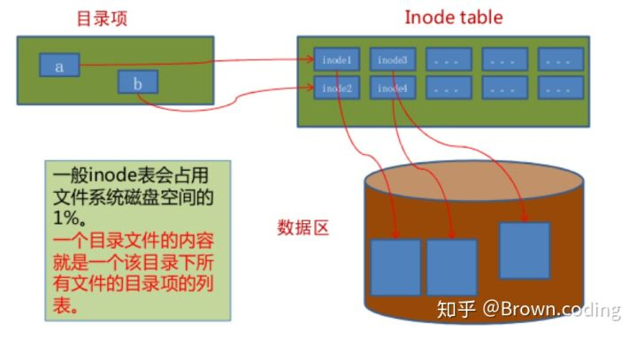

# 目录项对象


**VFS把目录当作文件看待**，所以在路径`/bin/vi`中，bin和vi都属于文件：

bin是特殊的目录文件

vi是普通文件

所以，路径中的每个组成部分都由一个索引节点对象表示。


既然这样，为什么还要有目录项这个东西呢？


虽然它们可以统一由索引节点表示，但是VFS经常需要执行目录相关的操作，比如路径名查找等。路径名查找需要解析路径中的每一个组成部分，不但要确保它有效，而且还需要再进一步寻找路径中的下一部分。

为了方便查找，VFS引入了目录项。每个`dentry`代表路径中的一个特定部分。对于`/bin/vi`来说，`/`、`bin`、`vi`都属于目录项对象。


所以，在路径中(包括普通文件)，每一部分都是目录项对象。


结构体如下：

```c
struct dentry {
	atomic_t d_count;
	unsigned int d_flags;		/* protected by d_lock */
	spinlock_t d_lock;		/* per dentry lock */
	int d_mounted;
	struct inode *d_inode;		/* Where the name belongs to - NULL is
					 * negative */
	/*
	 * The next three fields are touched by __d_lookup.  Place them here
	 * so they all fit in a cache line.
	 */
	struct hlist_node d_hash;	/* lookup hash list */
	struct dentry *d_parent;	/* parent directory */
	struct qstr d_name;

	struct list_head d_lru;		/* LRU list */
	/*
	 * d_child and d_rcu can share memory
	 */
	union {
		struct list_head d_child;	/* child of parent list */
	 	struct rcu_head d_rcu;
	} d_u;
	struct list_head d_subdirs;	/* our children */
	struct list_head d_alias;	/* inode alias list */
	unsigned long d_time;		/* used by d_revalidate */
	const struct dentry_operations *d_op;
	struct super_block *d_sb;	/* The root of the dentry tree */
	void *d_fsdata;			/* fs-specific data */

	unsigned char d_iname[DNAME_INLINE_LEN_MIN];	/* small names */
};

#ifdef __LITTLE_ENDIAN
#define HASH_LEN_DECLARE u32 hash; u32 len;
#else
#define HASH_LEN_DECLARE u32 len; u32 hash;
#endif

struct qstr {
	union {
		struct {
			HASH_LEN_DECLARE;
		};
		u64 hash_len;
	};
	const unsigned char *name;
};
```


- d_inode：相关联的索引节点

- d_parent：每个dentry的父目录是唯一的，所以dentry 有成员变量d_parent

- d_name：文件名

  qstr是quick string的缩写，注意，qstr中的name只存放路径的最后一个分量，即basename，/usr/bin/vim只会存放vim这个名字。当然，如果路径名比较短，就存放在`d_iname`中。注意此结构体中有hash，还有一个len变量隐藏在struct HASH_LEN_DECLARE中。

- d_subdirs：dentry也会有子目录对应的dentry，所以提供了d_subdirs，所有子目录对应的dentry都会挂在该链表上。

- d_child：dentry靠什么挂在其父dentry的以d_subdirs为头部的链表上？靠的是d_child成员比变量。

- d_hash：根据上面的结构体，已经可以查找某个目录是否在内存的dentry中，但是用链表查找太慢了，所以内核提供了hash表,d_hash会放置到hash表某个头节点所在的链表。

  但是计算hash值并不是简单的根据目录的basename来hash，否则会有大量的冲突，比如home下每一个用户的家目录中都会有Pictures，Video，Project等目录，名字重复的概率太高，因此，计算hash的时候，将父dentry的地址也放入了hash计算当中，影响最后的结果，这大大降低了发生碰撞的机会。

  也就是说一个dentry的hash值，取决于两个值：父dentry的地址和该dentry路径的basename。

  

  ```c
  static inline struct hlist_bl_head *d_hash(const struct dentry *parent,
                                          unsigned int hash)
  {
          hash += (unsigned long) parent / L1_CACHE_BYTES;
          return dentry_hashtable + hash_32(hash, d_hash_shift);
  }
  ```

  注意，如果一个目录book，但是每一次都要计算该basename的hash值，就会每次查找不得不计算一次book的hash，那效率就低了，因此， qstr结构体中有一个字段hash，一次算好，再也不算了。此处是稍微牺牲空间效率来提升时间效率，用空间来换时间，可以看出Linux将性能压榨到了极致，能提升性能的地方，绝不放过。


当然了，一开始可能某个目录对应的dentry根本就不在内存中，所以会有d_lookup函数，以父dentry和qstr类型的name为依据，来查找内存中是否已经有了对应的dentry，当然，如果没有，就需要分配一个dentry，这是d_alloc函数负责分配dentry结构体，初始化相应的变量，建立与父dentry的关系。


## **当我们读写文件时底层的工作原理是什么?**



访问一个文件的时候，先进入目录，目录中有相应的目录项，目录项中有对应的文件名和inode号，通过里面的指针指向相应的数据块，这样就访问到文件的内容了。目录这种“特殊的文件”，可以简单地理解为是一张表，这张表里面存放了属于该目录的文件的文件名，以及所匹配的inode编号,它本身的数据也放在数据区中；读写一个文件时就这样来回的从inode和数据区之间切换。可以把文件比作一本书，inode相当于书的目录，数据区相当于书的内容，读书时得先查目录，这本书呢又放在读书馆的书架上，书架可以理解为是目录，看书前先查书架子的索引。


一个被使用的目录项对应一个有效的索引节点（即d_inode撒向相应的索引节点）并且表明该对象存在一个或多个使用者（即d_count为正值）。

当d_count为0时，表明这个目录项未被使用，但该目录项仍指向一个有效的索引节点，此时应保留在缓存中以便需要时再使用。不会被过早地被撤销，所以以后再需要它时，不必重新创建，与未缓存的目录项对比，这样全路径查找更迅速。

当一个目录项没有对应有效的索引节点时（因为索引节点已经被删除了，或路径不再正确），这就是一个无效目录项，但这个目录项仍然保留，以便快速解析以后的路径查询。但open这样的系统调用会直接返回错误，不常用。


